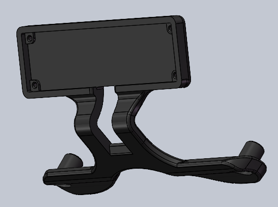
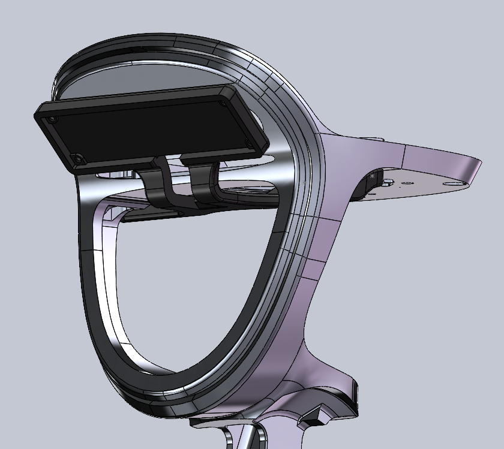
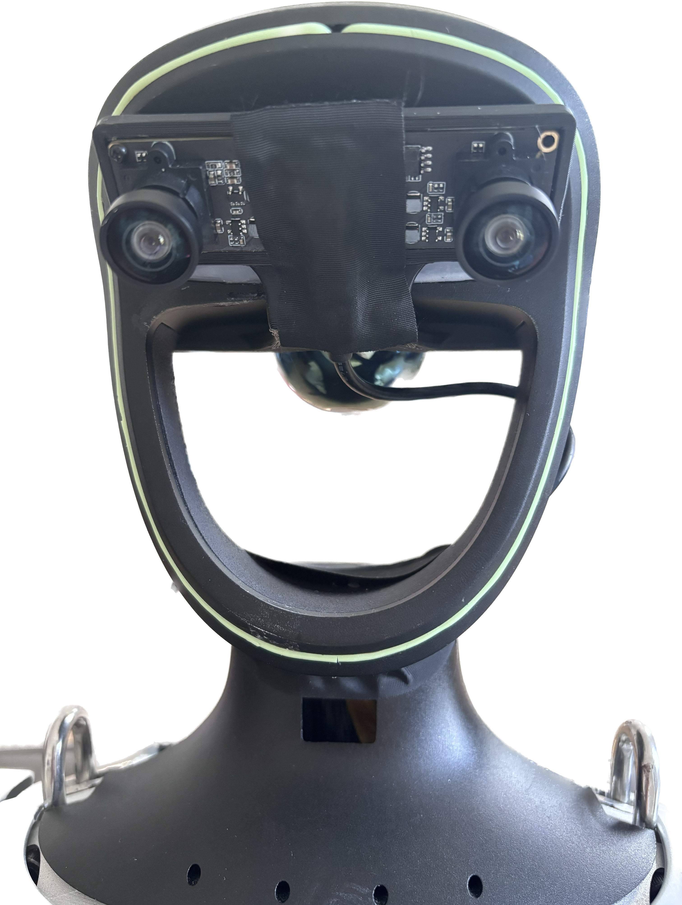
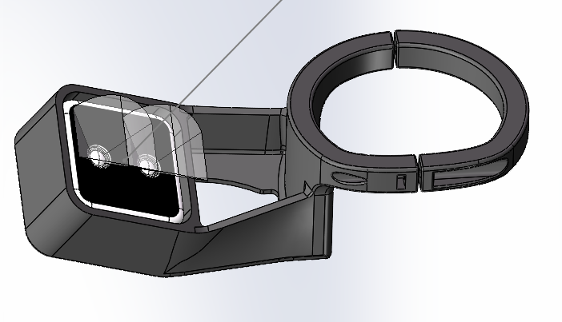
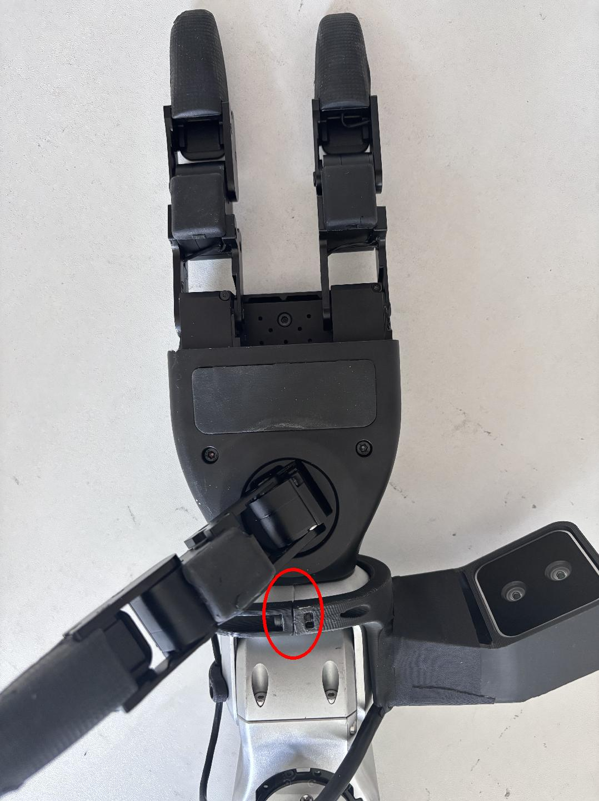
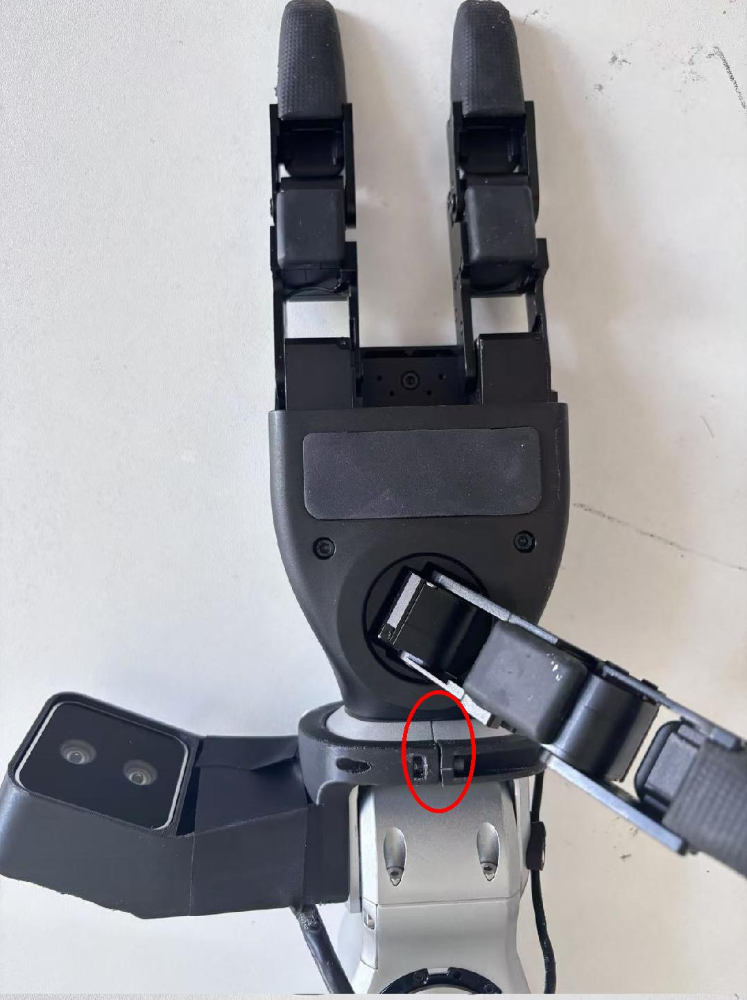

<div align="center">
  <h1 align="center">tele_robot</h1>
  <p align="center">
    <a href="README.md"> English </a> | <a href="README_zh-CN.md">中文</a> | <a>日本語</a>
  </p>
</div>

# 🔖 更新内容

1. **Vuerライブラリをアップグレード**し、より多くのXRデバイスモードに対応しました。従来の Apple Vision Pro に加え、**Meta Quest 3（コントローラー対応）** や **PICO 4 Ultra Enterprise（コントローラー対応）** にも対応しています。
2. 一部の機能を**モジュール化**し、Gitサブモジュール（`git submodule`）を用いて管理・読み込みを行うことで、コード構造の明確化と保守性を向上させました。
3. **ヘッドレスモード**、**運用モード**、**シミュレーションモード**を新たに追加し、起動パラメータの設定を最適化しました（第2.2節参照）。**シミュレーションモード**により、環境構成の検証やハードウェア故障の切り分けが容易になります。
4. デフォルトの手指マッピングアルゴリズムを Vector から **DexPilot** に変更し、指先のつまみ動作の精度と操作性を向上させました。
5. その他、さまざまな最適化を実施しました。


# 0. 📖 イントロダクション

このリポジトリでは、**XR（拡張現実）デバイス**（Apple Vision Pro、PICO 4 Ultra Enterprise、Meta Quest 3など）を使用して**ヒューマノイドロボット**の**遠隔操作**を実装しています。

必要なデバイスと配線図は以下の通りです。

<p align="center">
  <a href="">
    
  </a>
</p>


このリポジトリで現在サポートされているデバイス:

<table>
  <tr>
    <th align="center">🤖 ロボット</th>
    <th align="center">⚪ ステータス</th>
  </tr>
  <tr>
    <td align="center">TOPSTAR_H1</td>
    <td align="center">✅ 実装済み</td>
  </tr>
  <tr>
    <td align="center">TOPSTAR_H2</td>
    <td align="center">✅ 実装済み</td>
  </tr>
  <tr>
    <td align="center">吸盤（Suction Cup）</td>
    <td align="center">✅ 実装済み</td>
  </tr>
  <tr>
    <td align="center"> ··· </td>
    <td align="center"> ··· </td>
  </tr>
</table>


# 1. 📦 インストール

Ubuntu 22.04でテスト済みです。他のOSでは設定が異なる場合があります。本ドキュメントでは、主に通常モードについて説明します。

詳細は[公式ドキュメント](

## 1.1 📥 基本設定

```bash
# Create a conda environment
(base) user@host:~$ conda create -n tv python=3.10 pinocchio=3.1.0 numpy=1.26.4 -c conda-forge
(base) user@host:~$ conda activate tv
# Clone this repo
(tv) user@host:~$ git clone https://github.com/MatrixZTlab/tele_robot
(tv) user@host:~$ cd tele_robot
# Shallow clone submodule
(tv) user@host:~/tele_robot$ git submodule update --init --depth 1
# Install televuer submodule
(tv) user@host:~/tele_robot$ cd teleop/televuer
(tv) user@host:~/tele_robot/teleop/televuer$ pip install -e .
# Generate the certificate files required for televuer submodule
(tv) user@host:~/tele_robot/teleop/televuer$ openssl req -x509 -nodes -days 365 -newkey rsa:2048 -keyout key.pem -out cert.pem
# Install dex-retargeting submodule
(tv) user@host:~/tele_robot/teleop/televuer$ cd ../robot_control/dex-retargeting/
(tv) user@host:~/tele_robot/teleop/robot_control/dex-retargeting$ pip install -e .
# Install additional dependencies required by this repo
(tv) user@host:~/tele_robot/teleop/robot_control/dex-retargeting$ cd ../../../
(tv) user@host:~/tele_robot$ pip install -r requirements.txt
```

## 1.2 🕹️ TopstarSDK

```bash
# ロボット通信用ライブラリインストール
(tv) user@host:~$ git clone <your-sdk-url>
(tv) user@host:~$ cd TopstarSDK
(tv) user@host:~/TopstarSDK$ pip install -e .
```
>
> **注2**: コマンド前の識別子は「どのデバイスでどのディレクトリで実行するか」を示しています。
>
> Ubuntuの`~/.bashrc`デフォルト設定: `PS1='${debian_chroot:+($debian_chroot)}\u@\h:\w\$ '`
>
> 例: `(tv) user@host:~$ pip install meshcat`
>
> - `(tv)` conda環境`tv`を表示
> - `user@host:~` ユーザーが`Host`デバイスにログイン、カレントディレクトリは`$HOME`
> - `$` Bashシェル（非rootユーザー）
> - `pip install meshcat` は`Host`で実行するコマンド

# 2. 💻 シミュレーション環境

## 2.1 📥 環境設定

まずrobot_sim_isaaclabをインストールし、READMEに従って設定します。

シミュレーションを起動:

```bash
(base) user@host:~$ conda activate robot_sim_env
(robot_sim_env) user@host:~$ cd ~/robot_sim
(robot_sim_env) user@host:~/robot_sim$ python sim_main.py --device cpu --enable_cameras
```

シミュレーション起動後、ウィンドウをクリックして有効化。ターミナルに`controller started, start main loop...`と表示されます。

シミュレーションGUI:

<p align="center">    </p>

## 2.2 🚀 起動

物理ロボットとシミュレーションの両方でXR制御をサポート。コマンドライン引数でモード選択:

- **基本制御パラメータ**

| ⚙️ パラメータ |                📜 説明                |                         🔘 オプション                         | 📌 デフォルト |
| :----------: | :----------------------------------: | :----------------------------------------------------------: | :----------: |
| `--input-mode`  |           XR入力モード選択           | `hand` (**ハンドトラッキング**) `controller` (**コントローラートラッキング**) |    `hand`    |
|   `--robot`    | ロボットアームタイプ選択 (0. 📖 参照) |                 `TOPSTAR_H1` `TOPSTAR_H2`                  |   `TOPSTAR_H1`    |
|  `--control-mode`   |       制御モード選択（腕/頭/胴体）       |     `arms_only` `arms_head` `arms_head_torso` `full_body`      |   `arms_head`    |
|    `--ee`    |   エンドエフェクタ選択 (0. 📖 参照)   |                   `suction_cup`                   |     none     |
|    `--arm-scale`    |   腕のリーチ倍率（例：0.8）    |        任意の浮動小数点数         |       `1.0`       |

- **モードフラグ**

|   ⚙️ フラグ   |                            📜 説明                            |
| :----------: | :----------------------------------------------------------: |
|  `--record`  | **データ記録有効化**: **r**押下で開始後、**s**でエピソード記録開始/停止。繰り返し可能 |
|  `--motion`  | **モーション制御有効化**: 遠隔操作中に独立したロボット制御を許可。<br />ハンドモードではR3リモコンで歩行、コントローラーモードではジョイスティックで歩行 |
| `--headless` |             GUIなしで実行（ヘッドレスPC2展開用）             |
|   `--sim`    |               **シミュレーションモード**有効化               |
|   `--ipc`    | **プロセス間通信モード**: IPCを介してtele_robotの状態制御を可能に |
| `--affinity` | **CPUアフィニティモード**: CPUコアアフィニティ設定 |
|  `--replay`  | **リプレイモード**: 記録済み軌道を再生。`--replay`（高速）または`--replay first`（低速/安全） |
| `--replay-file` | リプレイする軌道JSONファイルのパス |

TOPSTAR_H2でシミュレーション、記録モードで起動:

```bash
(tv) user@host:~$ cd ~/tele_robot/teleop/
(tv) user@host:~/tele_robot/teleop/$ python teleop_hand_and_arm.py --robot=TOPSTAR_H2 --sim --record
# 吸盤付き:
(tv) user@host:~/tele_robot/teleop/$ python teleop_hand_and_arm.py --robot=TOPSTAR_H2 --ee=suction_cup --sim --record
```

プログラム起動後、ターミナル表示:

<p align="center">    </p>

次の手順:

1. XRヘッドセット（Apple Vision Pro、PICO4など）を装着

2. 対応するWi-Fiに接続

3. ブラウザ（SafariやPICO Browserなど）で以下にアクセス: `https://192.168.123.2:8012?ws=wss://192.168.123.2:8012`

   > **注1**: このIPは**Host**のIPと一致させる必要あり（`ifconfig`で確認）。
   > ​**​注2​**: 警告ページが表示される場合があります。[詳細設定]→[IPにアクセス（安全ではない）]を選択。

   <p align="center">    </p>

4. Vuerウェブで[Virtual Reality]をクリック。すべてのプロンプトを許可してVRセッションを開始。

   <p align="center">    </p>

5. ヘッドセットにロボットの一人称視点が表示されます。ターミナルに接続情報が表示:

```bash
websocket is connected. id:dbb8537d-a58c-4c57-b49d-cbb91bd25b90
default socket worker is up, adding clientEvents
Uplink task running. id:dbb8537d-a58c-4c57-b49d-cbb91bd25b90
```

6. 急な動きを防ぐため、ロボットの**初期姿勢**に腕を合わせる:

<p align="center">    </p>

7. ターミナルで**r**を押して遠隔操作を開始。ロボットアームと多指ハンドを制御できます。

8. 遠隔操作中、**s**で記録開始、再度**s**で停止・保存。繰り返し可能。

<p align="center">    </p>

> **注1**: 記録データはデフォルトで`teleop/utils/data`に保存。robot_IL_lerobotで使用方法を確認。
> **注2**: データ記録時はディスク容量に注意してください。

## 2.3 🔚 終了

ターミナル（または「record image」ウィンドウ）で**q**を押して終了。

# 3. 🤖 物理環境展開

物理環境展開の手順はシミュレーションと似ていますが、以下の点が異なります:

## 3.1 🖼️ 画像サービス

`tele_robot/teleop/teleimager`の画像サービスプログラムをロボット(TOPSTAR_H1/TOPSTAR_H2など)の**開発用計算ユニットPC2**に設定。

```bash
# SSHでPC2にログイン
(tv) user@host:~$ ssh user@192.168.123.164 "mkdir -p ~/teleimager"
# teleimagerのインストールはteleimagerリポジトリのREADMEを参照
(tv) user@host:~$ scp ~/tele_robot/teleop/televuer/key.pem ~/tele_robot/teleop/televuer/cert.pem user@192.168.123.164:~/teleimager/
```

**PC2**で以下を実行:

```bash
# 補足: 現在この画像転送プログラムは、OpenCVとRealsense SDKの2つの画像読み取り方法をサポート。`image_server.py`内の`ImageServer`クラスのコメントを参照し、カメラハードウェアに合わせて画像転送サービスを設定。
# ロボットPC2のターミナルで実行
user@pc2:~/image_server$ python image_server.py
# ターミナルに以下の出力が表示:
# {'fps': 30, 'head_camera_type': 'opencv', 'head_camera_image_shape': [480, 1280], 'head_camera_id_numbers': [0]}
# [Image Server] Head camera 0 resolution: 480.0 x 1280.0
# [Image Server] Image server has started, waiting for client connections...
```

画像サービス起動後、**Host**ターミナルで`image_client.py`を使用して通信テスト可能:

```bash
(tv) user@host:~/tele_robot/teleop/teleimager/src$ python -m teleimager.image_client --host 192.168.123.164
```

## 3.2 🚀 起動

> 
>
> 1. すべての人はロボットから安全な距離を保ち、潜在的な危険を防止してください！
> 2. このプログラムを実行する前に、少なくとも一度は公式ドキュメントをお読みください。
> 3. `--motion`なしの場合、ロボットがデバッグモード（L2+R2）に入り、モーション制御プログラムが停止していることを確認してください。これにより潜在的なコマンド競合問題を回避できます。
> 4. モーションモード（`--motion`あり）を使用する場合、ロボットが制御モード（R3リモコン経由）にあることを確認。
> 5. モーションモード時:
>    - 右コントローラー**A** = 遠隔操作終了
>    - 両ジョイスティック押下 = ソフト非常停止（ダンピングモードに切替）
>    - 左ジョイスティック = 移動方向;
>    - 右ジョイスティック = 旋回;
>    - 最大速度はコード内で制限。

シミュレーションと同じですが、上記の安全警告に従ってください。

## 3.3 🔚 終了

> 
>
> ロボット損傷を防ぐため、終了前にロボットの腕を初期姿勢に近づけることを推奨。
>
> - **デバッグモード**: 終了キー押下後、両腕は5秒以内にロボットの**初期姿勢**に戻り、制御終了。
> - **モーションモード**: 終了キー押下後、両腕は5秒以内にロボットの**モーション制御姿勢**に戻り、制御終了。

シミュレーションと同じですが、上記の安全警告に従ってください。

# 4. 🗺️ コード構成

```
tele_robot/
│
├── assets                    [ロボットURDF関連ファイル格納]
│
├── teleop
│   ├── teleimager            [画像サービスライブラリ、複数の機能をサポート]
│   │
│   ├── televuer
│   │      ├── src/televuer
│   │         ├── television.py       [XRデバイスの頭部、手首、手・コントローラーのデータを取得]
│   │         ├── tv_wrapper.py       [取得データの後処理]
│   │      ├── test
│   │         ├── _test_television.py [television.pyのテスト]
│   │         ├── _test_tv_wrapper.py [tv_wrapper.pyのテスト]
│   │
│   ├── robot_control
│   │      ├── src/dex-retargeting [多指ハンドリターゲティングアルゴリズムライブラリ]
│   │      ├── robot_arm_ik.py     [アームの逆運動学]
│   │      ├── robot_arm.py        [両腕関節を制御し他をロック]
│   │      ├── hand_retargeting.py [多指ハンドリターゲティングアルゴリズムラッパー]
│   │      ├── robot_hand.py  [ハンド/吸盤関節を制御]
│   │
│   ├── utils
│   │      ├── episode_writer.py          [模倣学習用データ記録]
│   │      ├── weighted_moving_filter.py  [関節データのフィルタリング]
│   │      ├── rerun_visualizer.py        [記録中のデータ可視化]
│   │
│   └── teleop_hand_and_arm.py    [遠隔操作起動実行コード]
```

# 5. 🛠️ ハードウェア

## 5.1 📋 部品リスト

|          アイテム          | 数量 |                            リンク                            |                             備考                             |
| :------------------------: | :--: | :----------------------------------------------------------: | :----------------------------------------------------------: |
| **ヒューマノイドロボット** |  1   |                                       |                    開発用計算ユニット付属                    |
|       **XRデバイス**       |  1   | https://www.apple.com/apple-vision-pro/ https://www.meta.com/quest/quest-3 https://www.picoxr.com/products/pico4-ultra-enterprise |                                                              |
|        **ルーター**        |  1   |                                                              |   **デフォルトモード**で必要; **ワイヤレスモード**では不要   |
|       **ユーザーPC**       |  1   |                                                              | **シミュレーションモード**では、公式推奨ハードウェアリソースを使用。 |
|  **ヘッドステレオカメラ**  |  1   |    [参考] http://e.tb.cn/h.TaZxgkpfWkNCakg?tk=KKz03Kyu04u    |                      ロボット頭部視点用                      |
|  **ヘッドカメラマウント**  |  1   |  |                ヘッドステレオカメラ取り付け用                |
| Intel RealSense D405カメラ |  2   |      https://www.intelrealsense.com/depth-camera-d405/       |                            手首用                            |
|     手首リングマウント     |  2   |  |                   手首カメラマウントと併用                   |
|     左手首D405マウント     |  1   |  |             左手首RealSense D405カメラ取り付け用             |
|     右手首D405マウント     |  1   |  |             右手首RealSense D405カメラ取り付け用             |
|       M3-1六角ナット       |  4   |                [参考] https://a.co/d/1opqtOr                 |                          手首固定用                          |
|         M3x12ネジ          |  4   |              [参考] https://amzn.asia/d/aU9NHSf              |                          手首固定用                          |
|          M3x6ネジ          |  4   |              [参考] https://amzn.asia/d/0nEz5dJ              |                          手首固定用                          |
|       **M4x14ネジ**        |  2   |              [参考] https://amzn.asia/d/cfta55x              |                          頭部固定用                          |
|      **M2x4自攻ネジ**      |  4   |              [参考] https://amzn.asia/d/1msRa5B              |                          頭部固定用                          |

>  注: 太字のアイテムは遠隔操作タスクに必須の設備、その他はデータセット記録用のオプション設備。

## 5.2 🔨 取り付け図

<table> <tr> <th align="center">アイテム</th> <th align="center" colspan="2">シミュレーション</th> <th align="center" colspan="2">実機</th> </tr> <tr> <td align="center">頭部</td> <td align="center"> <p align="center">  <figcaption>頭部マウント</figcaption> </p> </td> <td align="center"> <p align="center">  <figcaption>取り付け側面図</figcaption> </p> </td> <td align="center" colspan="2"> <p align="center">  <figcaption>取り付け正面図</figcaption> </p> </td> </tr> <tr> <td align="center">手首</td> <td align="center" colspan="2"> <p align="center">  <figcaption>手首リングとカメラマウント</figcaption> </p> </td> <td align="center"> <p align="center">  <figcaption>左手取り付け図</figcaption> </p> </td> <td align="center"> <p align="center">  <figcaption>右手取り付け図</figcaption> </p> </td> </tr> </table>

> 注: 手首リングマウントは、ロボットの手首の継ぎ目に合わせて取り付け（画像の赤丸部分）。

# 6. 🙏 謝辞

このコードは以下のオープンソースコードを基にしています。各LICENSEはURLで確認してください:

1. https://github.com/OpenTeleVision/TeleVision
2. https://github.com/dexsuite/dex-retargeting
3. https://github.com/vuer-ai/vuer
4. https://github.com/stack-of-tasks/pinocchio
5. https://github.com/casadi/casadi
6. https://github.com/meshcat-dev/meshcat-python
7. https://github.com/zeromq/pyzmq
8. https://github.com/Dingry/BunnyVisionPro
10. https://github.com/unitreerobotics/xr_teleoperate